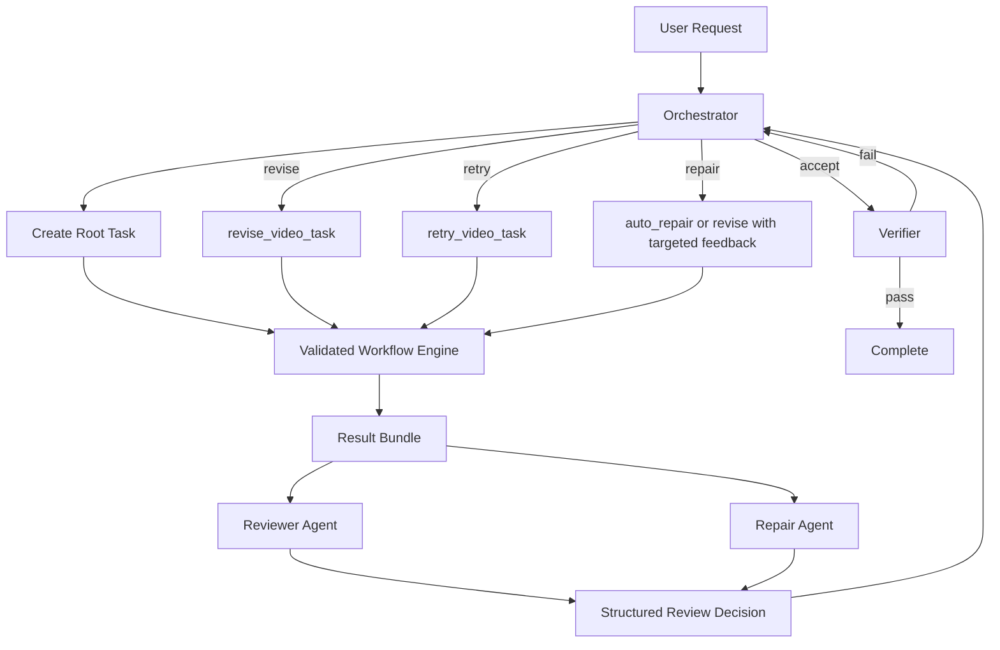

# Multi-Agent Workflow Design

**Goal:** Add a practical multi-agent workflow on top of the current validated Manim task engine so review feedback can reliably drive regeneration without breaking the existing task ownership, session memory, and repair model.

## 1. Background

`easy-manim` already has a strong single-lineage execution core:

1. authenticated agent identity
2. task creation and ownership
3. validated generation pipeline
4. revision / retry / auto-repair
5. session memory and persistent memory
6. scorecards and profile suggestions

The system is not yet a native multi-agent orchestration platform. In particular:

1. task mutation is ownership-scoped to one `agent_id`
2. memory and profile state are also agent-scoped
3. there is no built-in supervisor that coordinates reviewer, repairer, and verifier roles

Because of those constraints, the safest path is not "true shared ownership multi-agent" first. The safest path is a supervised workflow where multiple logical agents collaborate around one owned task lineage.

## 2. Design Goals

This workflow should:

1. let a reviewer propose structured changes after each generation
2. let the system automatically regenerate from that review
3. preserve current validation-first behavior
4. keep task ownership simple and secure
5. work through both HTTP and MCP surfaces
6. remain debuggable through artifacts, events, and lineage

This workflow should not initially:

1. allow arbitrary agents to mutate each other's tasks
2. require a distributed planner or general-purpose multi-agent runtime
3. introduce free-form autonomous loops without stop conditions

## 3. Options

### Option A: Role-based workflow under one owner identity

This option introduces several logical agents, but only one orchestrator identity owns and mutates tasks. Specialist agents act on task bundles and return decisions or feedback.

Pros:

1. minimal change to current auth model
2. reuses `create_video_task`, `revise_video_task`, `retry_video_task`, and `auto_repair`
3. easiest to ship and debug

Cons:

1. not "true" multi-agent shared ownership
2. reviewer agents need task bundles passed in by the orchestrator

### Option B: Supervisor plus separate reviewer identities with shared review bundles

This option keeps orchestrator-owned mutations, but allows separate agent identities to read shared review bundles or review-specific resources. Mutation still flows through the orchestrator.

Pros:

1. cleaner role separation
2. better auditability for review decisions

Cons:

1. requires shared-read collaboration resources
2. still not full shared task mutation

### Option C: True collaborative task ownership

This option adds task ACLs or workflow-level ownership so multiple agents can read and mutate the same lineage directly.

Pros:

1. strongest native multi-agent model
2. most flexible long-term

Cons:

1. highest complexity
2. largest auth and data model changes
3. greatest risk of regressions

## 4. Recommendation

Recommend **Option A now**, then grow toward Option B if needed.

Reason:

1. the current system's strength is its validated single-lineage workflow
2. the current system's weakness is native cross-agent orchestration
3. Option A improves collaboration without fighting the current ownership and memory model

This means the first version should be understood as:

1. **multi-agent in role behavior**
2. **single-owner in task mutation**

That matches the current platform far better than forcing true shared ownership too early.

## 5. Recommended Roles

### 5.1 Orchestrator Agent

Responsibilities:

1. accepts the user goal
2. creates the root task
3. decides which specialist agent runs next
4. converts review decisions into `revise`, `retry`, or `stop`
5. enforces loop budgets and escalation

This is the only role that should mutate tasks in phase 1.

### 5.2 Generator Agent

Responsibilities:

1. shape generation intent before task creation when needed
2. propose output profile and style hints
3. help transform vague requests into generation-ready input

In many cases this role can stay lightweight because the core generation is already handled by the existing workflow engine.

### 5.3 Reviewer Agent

Responsibilities:

1. inspect the task result bundle
2. evaluate against user intent and validation output
3. produce a structured review decision
4. identify what should be preserved vs changed

This role should be read-only in phase 1.

### 5.4 Repair Agent

Responsibilities:

1. focus on failures or quality issues
2. convert failure contracts and review findings into precise feedback
3. recommend `retry`, targeted `revise`, or `auto_repair`

This role should also be read-only in phase 1. It returns feedback to the orchestrator.

### 5.5 Verifier Agent

Responsibilities:

1. decide whether the latest result is acceptable
2. confirm stop conditions
3. guard against endless "slightly better" revision loops

This role is the final gate before completion.

## 6. Core Workflow



## 7. Result Bundle Contract

The reviewer and repair agents should not pull arbitrary live state. The orchestrator should assemble a stable bundle for them.

Recommended bundle fields:

1. `task_id`
2. `root_task_id`
3. `attempt_count`
4. `prompt`
5. `feedback`
6. `display_title`
7. `status`
8. `phase`
9. `latest_validation_summary`
10. `failure_contract`
11. `script_resource`
12. `video_resource`
13. `preview_frame_resources`
14. `task_events`
15. `session_memory_summary`

This should be enough for review without giving broad raw access.

## 8. Structured Review Decision

The reviewer should return a deterministic structure instead of free-form prose.

Recommended schema:

```json
{
  "decision": "accept | revise | retry | repair | escalate",
  "summary": "short human-readable conclusion",
  "preserve_working_parts": true,
  "confidence": 0.0,
  "issues": [
    {
      "code": "timing_off | cluttered_layout | weak_emphasis | render_failure | validation_issue",
      "severity": "low | medium | high",
      "evidence": "what went wrong",
      "action": "what should change"
    }
  ],
  "feedback": "text passed into revise or repair",
  "stop_reason": null
}
```

Key rule:

1. only the orchestrator converts this into task mutations
2. if `decision=accept`, no mutation occurs
3. if `decision=revise`, use `revise_video_task`
4. if `decision=retry`, use `retry_video_task`
5. if `decision=repair`, prefer targeted feedback

## 9. Recommended Decision Policy

The orchestrator should apply a simple policy tree:

1. if latest task completed and reviewer says acceptable, go to verifier
2. if latest task failed and failure contract is retryable, call repair agent first
3. if reviewer reports content or UX quality issues, call `revise_video_task`
4. if infrastructure or provider failure is transient, call `retry_video_task`
5. if repeated issue code appears beyond budget, escalate to human review

This keeps the loop deterministic.

## 10. Stop Conditions

The system must not loop forever.

Recommended hard stops:

1. max 1 root task + 3 child attempts by default
2. max 2 consecutive revisions with the same primary issue code
3. max 1 retry for transient provider/runtime failures
4. stop immediately on non-retryable safety or policy failures
5. stop when verifier confidence is below threshold after budget is exhausted

Recommended completion conditions:

1. validation passes
2. reviewer returns `accept`
3. verifier confirms the result matches the user goal

## 11. Memory Strategy

Phase 1 should reuse the existing memory model instead of inventing a new one.

Recommended behavior:

1. root task starts with normal clean creation flow
2. every revision, retry, and repair continues to inherit `session_id`
3. reviewer and repair agents consume the current `session_memory_summary`
4. successful completed lineages can be promoted into persistent memory
5. profile suggestion remains optional and should stay out of the critical path

This keeps "creative memory", "repair memory", and "profile learning" connected without merging them into one opaque loop.

## 12. Auth and Ownership Model

Phase 1 should preserve the current ownership constraint:

1. tasks belong to one owner `agent_id`
2. only the orchestrator identity mutates tasks
3. specialist agents are logical roles or external workers that operate on task bundles

If true separate identities are required later, add a collaboration layer rather than weakening ownership checks. That layer should introduce:

1. workflow-level shared context
2. explicit task collaboration grants
3. read vs mutate capabilities by role

## 13. New Components To Add

Recommend adding the following thin components:

1. `MultiAgentWorkflowService`
   coordinates orchestrator decisions around a root task lineage
2. `ReviewBundleBuilder`
   assembles the stable task bundle for reviewer and repair roles
3. `ReviewDecision`
   typed schema for reviewer output
4. `WorkflowLoopPolicy`
   centralizes stop conditions and retry / revise routing

Optional later:

1. `workflow_runs` store for high-level run tracking
2. `task_reviews` store or artifact for historical review decisions

## 14. Integration Points

The workflow should reuse the current core as much as possible:

1. task creation via `TaskService.create_video_task`
2. revision via `TaskService.revise_video_task`
3. retry via `TaskService.retry_video_task`
4. targeted repair through existing auto-repair behavior or orchestrator-issued revise
5. validation and artifacts from `WorkflowEngine`
6. lineage memory from `SessionMemoryService`

The new multi-agent layer should sit above the validated pipeline, not inside it.

## 15. Phase Plan

### Phase 1: Practical supervised multi-agent loop

Deliver:

1. orchestrator service
2. review bundle builder
3. structured review decision
4. automatic revise / retry routing
5. verifier gate and loop budgets

Expected outcome:

1. review-driven regeneration works
2. multi-agent collaboration quality improves without auth redesign

### Phase 2: Shared review surfaces

Deliver:

1. review artifacts or review records
2. reviewer-specific read APIs or resources
3. per-lineage workflow status

Expected outcome:

1. clearer auditing
2. cleaner separation for specialist reviewer identities

### Phase 3: True collaborative ownership

Deliver:

1. task collaboration ACLs
2. workflow-level shared context independent from single `agent_id`
3. direct cross-agent mutation permissions where explicitly granted

Expected outcome:

1. native multi-agent orchestration rather than role simulation

## 16. Expected Capability Improvement

Based on the current evaluation:

1. current general multi-agent collaboration capability is about `6.2/10`
2. after phase 1, it should realistically reach `7.4/10` to `7.8/10`
3. after phase 2, it can reach `8.0/10` for this domain
4. only phase 3 would justify calling it a strong native multi-agent system

The important point is that phase 1 already unlocks the workflow the product needs most:

1. generate
2. review
3. regenerate from review
4. stop with evidence

## 17. Final Recommendation

Build the first multi-agent workflow as a **supervised review-regenerate loop** rather than as a fully shared agent mesh.

That gives the project the biggest gain for the lowest architectural risk:

1. it respects the current task ownership model
2. it leverages the current validated pipeline
3. it makes reviewer feedback operational instead of advisory
4. it keeps future expansion to true collaborative multi-agent open
