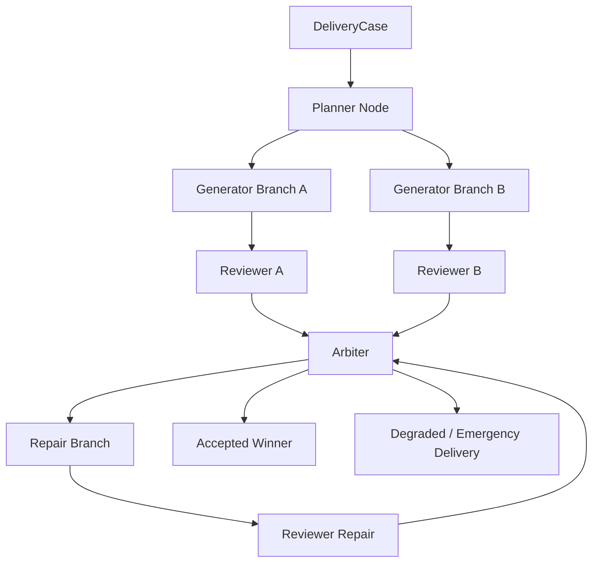

# P2 Native Multi-Agent Design

## Goal

Evolve the current video agent from a reliable single-lineage workflow with optional review hooks into a native collaborative system where specialized agents can plan, critique, repair, and arbitrate in parallel while the root delivery contract still guarantees one of two outcomes:

1. a delivered video artifact, or
2. a deterministic, observable terminal stop reason.

P2 is design only. P0/P1 already strengthened the reliability floor with:

- startup reconciliation,
- watchdog recovery,
- atomic emergency delivery,
- runtime hard-readiness checks,
- delivery SLO summary,
- real-environment delivery canary.

P2 must build on those controls, not bypass them.

## Current Baseline

Today the system already has several building blocks:

- `WorkflowEngine` executes a single task attempt end-to-end and can auto-repair or trigger degraded/emergency delivery.
- `TaskReliabilityService` reconciles pending roots, resumes failed leaf attempts, and prevents stuck tasks from silently hanging forever.
- `MultiAgentWorkflowService` exposes planner/reviewer/repairer semantics, but only as a post-hoc review loop over an already-created task lineage.
- `ReviewBundleBuilder` assembles scene spec, failure contract, recovery plan, validation, and quality signals into a reviewer-facing bundle.
- root-level delivery metadata (`delivery_status`, `resolved_task_id`, `completion_mode`, `delivery_stop_reason`) already provides the right contract surface for “did we deliver?”

This means P2 does not need a fresh architecture from scratch. It needs a native orchestration layer above the existing reliable task substrate.

## Main Gaps

### 1. Collaboration is descriptive, not execution-native

The current planner/reviewer/repairer roles are reconstructed from artifacts after execution. They are not durable runtime actors with owned state, budgets, or independently auditable decisions.

### 2. The attempt model is linear

Current lineage is basically:

- root attempt
- optional repair child
- optional degraded child
- optional emergency fallback

That works for resilience, but it does not support parallel candidate generation, comparative review, or challenger branches.

### 3. There is no shared case memory for collaborating agents

We have session memory and persistent memory, but no typed, per-delivery shared working memory where planner output, reviewer findings, repair constraints, arbitration notes, and branch comparisons can accumulate.

### 4. Arbitration is too coarse

Acceptance and escalation are policy-guarded, but there is no first-class selection protocol for:

- multiple parallel candidates,
- conflicting reviewer judgments,
- confidence-weighted tradeoffs,
- choosing “best acceptable” under budget pressure.

### 5. Governance is rollout-profile based, not role/budget based

Feature flags are useful, but P2 needs execution-level governance:

- which roles may run automatically,
- how many branches may be opened,
- how much repair budget is allowed,
- when human approval is mandatory,
- which stop reasons force immediate halt.

## Design Principles

### Reliability first

P2 must preserve the P0/P1 promise that a root request keeps progressing until it either delivers or lands in a deterministic terminal state. Native multi-agent orchestration cannot reintroduce silent hangs or ambiguous partial completion.

### Root contract stays simple

No matter how many specialized agents participate, the root delivery record should still answer:

- did we deliver?
- which branch won?
- what completion mode produced the artifact?
- if we failed, why did we stop?

### Roles become first-class

Planner, reviewer, repairer, and orchestrator state should be stored as typed records, not inferred from logs alone.

### Parallelism must be governed

Parallel branches are valuable only if they are bounded by explicit budgets and selection rules.

### Migration over rewrite

P2 should reuse:

- existing `VideoTask` storage,
- current artifact model,
- recovery/failure-contract machinery,
- current delivery guarantee finalization path.

## Proposed Architecture

### 1. Introduce a Delivery Case as the native orchestration envelope

Add a new top-level concept: `DeliveryCase`.

`DeliveryCase` owns:

- one user request,
- one delivery objective,
- one shared case memory timeline,
- one orchestration state machine,
- one winning branch or one terminal stop reason.

In the initial migration phase, `DeliveryCase.case_id` can equal the current root task id to avoid a disruptive identity split.

### 2. Replace the purely linear lineage with a governed branch graph

Keep `VideoTask` as the executable render unit, but treat it as a node inside a case graph rather than the whole workflow.

New graph concepts:

- `CaseNode`: planner, generator, reviewer, repairer, arbiter, delivery-fallback
- `branch_id`: identifies one candidate path
- `parent_node_ids`: allows fan-out and fan-in
- `supersedes_node_id`: explicit replacement chain for revised attempts
- `selection_state`: proposed, shortlisted, accepted, rejected, exhausted

This preserves current single-lineage compatibility while allowing future parallel branches.

### 3. Make specialized agent roles durable runtime actors

Introduce `AgentRun` records with explicit ownership:

- `role`: orchestrator, planner, generator, reviewer, repairer, gatekeeper
- `input_refs`: scene spec, failure contract, winning artifacts, prior decisions
- `output_refs`: artifacts, decisions, recommendations
- `status`: queued, running, completed, failed, cancelled
- `confidence`
- `budget_token_cost`, `elapsed_seconds`, `attempt_index`
- `stop_reason`

This creates a durable audit trail without requiring every role to be backed by a separate external process on day one.

### 4. Add Shared Case Memory

Introduce a typed shared memory layer for each delivery case:

- `planner_notes`
- `review_findings`
- `repair_constraints`
- `branch_comparisons`
- `decision_log`
- `delivery_invariants`

This is distinct from session memory:

- session memory is user/session oriented
- shared case memory is work-product oriented

Key rule:

Only structured facts, constraints, and adjudicated findings may enter shared case memory. Free-form role chatter should stay in logs/events.

### 5. Add an explicit arbitration layer

Introduce an `ArbitrationService` that decides which branch advances.

Inputs:

- validation reports,
- quality scorecards,
- recovery plans,
- reviewer decisions,
- branch cost,
- elapsed budget,
- unresolved blocker codes,
- delivery guarantee urgency.

Outputs:

- accepted winner,
- open repair on chosen branch,
- spawn challenger branch,
- degrade,
- emergency fallback,
- escalate to human.

Arbitration should be deterministic from stored inputs where possible, so restart reconciliation can safely resume from the same state.

### 6. Keep delivery guarantee as the final root-level resolver

P2 should not invent a second delivery contract.

Instead:

- rich multi-agent exploration happens inside the case graph,
- once a winner exists, current root-resolution machinery finalizes delivery,
- if no rich branch succeeds within policy, existing degraded/emergency fallback still resolves the case.

This is the key architectural bridge between P1 reliability and P2 autonomy.

## Proposed Runtime Components

### Orchestrator Service

Responsibilities:

- create `DeliveryCase`
- allocate branch budget
- spawn planner/generator/reviewer/repairer work items
- call arbitration after new evidence arrives
- enforce governance policy
- trigger final delivery resolution

### Planner Service

Responsibilities:

- produce structured scene plan variants
- choose or recommend generation modes
- record explicit constraints and risks for downstream branches

### Reviewer Service

Responsibilities:

- convert validation/quality/recovery signals into branch judgments
- mark must-fix issues
- supply comparative branch notes

### Repair Coordinator

Responsibilities:

- convert failure contracts + recovery plan + shared constraints into actionable repair tasks
- distinguish “repair selected branch” from “spawn alternate candidate”

### Arbitration Service

Responsibilities:

- select winners,
- reject weak branches,
- enforce confidence thresholds,
- trigger fallback modes when branch budgets are exhausted.

### Governance Service

Responsibilities:

- enforce role-level rollout profile,
- max open branches,
- max review loops,
- mandatory human gates,
- allowed completion modes by environment.

This can evolve from current `capability_rollout_profile` support instead of replacing it outright.

## Data Model Additions

### New tables

`delivery_cases`

- `case_id`
- `root_task_id`
- `status`
- `selected_branch_id`
- `selected_task_id`
- `delivery_status`
- `completion_mode`
- `stop_reason`
- `created_at`
- `updated_at`

`case_nodes`

- `node_id`
- `case_id`
- `branch_id`
- `node_type`
- `owner_role`
- `task_id` nullable
- `parent_node_ids_json`
- `selection_state`
- `status`
- `confidence`
- `payload_json`

`agent_runs`

- `run_id`
- `case_id`
- `node_id`
- `role`
- `status`
- `input_refs_json`
- `output_refs_json`
- `decision_json`
- `stop_reason`
- `started_at`
- `finished_at`

`case_memory_entries`

- `entry_id`
- `case_id`
- `entry_type`
- `producer_role`
- `scope`
- `content_json`
- `created_at`

### Existing tables reused

- `video_tasks`
- `task_events`
- artifacts
- validations
- quality scorecards

The goal is additive migration, not destructive replacement.

## State Machine

### DeliveryCase states

- `queued`
- `planning`
- `branching`
- `reviewing`
- `repairing`
- `arbitrating`
- `delivering`
- `completed`
- `failed`
- `escalated`

### Branch states

- `proposed`
- `running`
- `awaiting_review`
- `repair_candidate`
- `shortlisted`
- `rejected`
- `accepted`
- `exhausted`

### Transition rules

- only the orchestrator may move a case into `delivering`
- only arbitration may mark a branch `accepted`
- watchdog/reconciler may mark branches or cases `failed` with deterministic stop reasons
- delivery guarantee may still finalize `completed` via degraded or emergency modes

## Governance Model

### Policy dimensions

Add role-aware governance on top of current rollout profiles:

- max parallel generator branches
- max reviewer quorum size
- max repair loops per branch
- max total branch count per case
- max total runtime per case
- max total model spend per case
- require human approval for:
  - cross-branch auto-promotion
  - low-confidence acceptance
  - emergency-only delivery
  - policy override

### Suggested rollout tiers

`supervised`

- one planner
- one generator
- one reviewer
- one repair branch
- no challenger branches
- no autonomous acceptance

`autonomy-lite`

- one planner
- up to two generator branches
- reviewer quorum of one or two
- autonomous selection only above confidence threshold

`autonomy-guarded`

- parallel challengers enabled
- automatic repair branching enabled
- arbitration can auto-accept with rollback telemetry and canary health green

## Reliability Integration

P2 must extend the new P0/P1 controls rather than sidestep them.

### Startup reconciliation

`TaskReliabilityService` should evolve into `CaseReliabilityService` that:

- restores case orchestration state after restart,
- resumes stalled nodes,
- re-runs arbitration if enough evidence already exists,
- syncs case-level delivery state to the winning descendant task.

### Watchdog

The watchdog should detect:

- stalled agent runs,
- orphaned branches,
- cases stuck in arbitration,
- branches waiting on missing artifacts.

### Delivery summary

Runtime SLO summary should expand from root-task only to include:

- cases by terminal completion mode,
- branch rejection rate,
- arbitration success rate,
- repair-loop saturation rate,
- emergency fallback share.

### Delivery canary

The canary should eventually support two modes:

- `single-branch canary`: current P1 behavior, cheapest health check
- `native-multi-agent canary`: planner + reviewer + arbitration path with bounded branches

The second mode should not ship until the first multi-agent orchestration path is restart-safe.

## Execution Flow

### Normal case

1. Create `DeliveryCase` and root task.
2. Planner emits one structured scene plan and optional alternates.
3. Orchestrator opens one primary generator branch.
4. Reviewer scores the output.
5. If accepted, arbitration selects it and root delivery resolves.

### Challenged case

1. Planner marks medium/high risk.
2. Orchestrator opens a challenger generator branch.
3. Reviewers compare both branches.
4. Arbitration chooses the best acceptable candidate.
5. Losing branch is rejected, winner resolves root delivery.

### Repair case

1. Reviewer marks must-fix issues.
2. Repair coordinator opens a repair branch using failure contract + recovery plan.
3. Reviewer reevaluates repaired output.
4. Arbitration either accepts it or exhausts branch budget.
5. Delivery guarantee degrades or emergency-resolves if needed.

## Migration Plan

### Phase 1: Persist collaboration state without parallelism

- add `delivery_cases`
- add `agent_runs`
- store planner/reviewer/repairer outputs as durable records
- keep one active branch only

Outcome:

Current system behavior stays nearly identical, but collaboration becomes auditable and restartable.

### Phase 2: Add orchestrator-driven branching with one challenger

- allow planner to recommend one alternate branch
- add arbitration service
- keep repair linear per chosen branch

Outcome:

We gain native comparison without exploding complexity.

### Phase 3: Add shared case memory and repair-aware arbitration

- promote structured findings into shared case memory
- let repair branches inherit typed constraints
- let arbitration compare repaired and unrepaired branches

Outcome:

Repair becomes contextual instead of stateless.

### Phase 4: Add guarded autonomous rollout

- enable role-aware governance
- gate higher-autonomy modes behind delivery canary and SLO thresholds
- add rollback path when branch-level success rate regresses

Outcome:

The system becomes more autonomous only when evidence says it is safe.

## Risks

### Branch explosion

Without strict budgets, native multi-agent orchestration will create cost and latency blowups.

Mitigation:

- hard branch caps,
- arbitration checkpoints,
- explicit “reject and stop” behavior.

### Non-deterministic arbitration

If arbitration depends on unstored transient reasoning, restart recovery becomes unsafe.

Mitigation:

- persist all inputs and arbitration outputs,
- prefer typed scoring and rule-based gating over hidden heuristics.

### Memory contamination

If noisy intermediate role chatter enters shared memory, later branches may overfit to bad conclusions.

Mitigation:

- typed shared memory,
- only adjudicated findings become durable case memory.

### Delivery contract drift

If case-level orchestration and root-task delivery metadata drift apart, operators lose trust.

Mitigation:

- root delivery metadata remains the canonical operator surface,
- case state syncs into the current root-task resolution contract.

## Recommended First Implementation Slice

The first P2 implementation should be intentionally narrow:

1. add `DeliveryCase` + `AgentRun` persistence
2. wrap the current single-branch flow in an orchestrator state machine
3. persist collaboration outputs from planner/reviewer/repairer as first-class records
4. keep branch count at one
5. reuse current reconciliation, delivery guarantee, and stop-reason semantics

This gives us native orchestration scaffolding without betting the product on parallel branching immediately.

## Success Criteria

P2 should be considered successful only when all of the following are true:

- multi-agent collaboration is restart-safe
- planner/reviewer/repairer outputs are durable and queryable
- root delivery status remains deterministic
- arbitration decisions are auditable
- autonomous branching is budget-bounded
- delivery canary and SLO views can distinguish native multi-agent regressions from baseline failures

## Recommendation

Implement P2 as an orchestration and persistence upgrade over the current reliable task substrate, not as a new execution engine. The existing root-task delivery contract, reliability reconciler, failure-contract pipeline, and fallback delivery path are strong enough to serve as the stable foundation. The highest-value next step is making multi-agent collaboration stateful and restartable before enabling true parallel branch competition.
